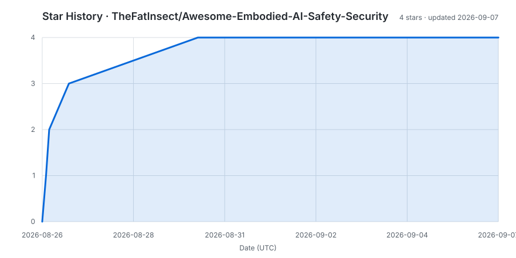

<a id="top"></a>

<p align="center">
  
</p>

<div align="center">

# Awesome Embodied AI Safety & Security

[](https://awesome.re)
[](https://github.com/TheFatInsect/Awesome-Embodied-AI-Safety-Security)
[](#maintenance-and-contributing)

An evidence-first collection of **security, safety, robustness, and evaluation research for foundation-model-driven embodied systems**.

<sub>Perception → Reasoning → Planning → Action</sub>

[Surveys (35)](#surveys) · [Attacks (43)](#attacks) · [Defenses (20)](#defenses) · [Benchmarks (25)](#benchmarks) · [Ranking guide](#how-to-read-the-tables) · [Perspectives](#expert-perspectives--frontier-reading) · [Contributing](#maintenance-and-contributing)

</div>

## Scope and curation policy

This list focuses on systems in which a large language model (LLM), vision-language model (VLM), vision-language-action model (VLA), or vision-language-navigation model (VLN) participates in a perception-to-action loop. A work is included when it studies a concrete security or safety problem, mitigation, audit method, or evaluation setting that can affect embodied planning, interaction, control, or physical execution.

The catalog contains **123 categorized entries**: 35 related surveys and 88 technical studies. Boundary-setting work may be cross-listed when it serves distinct roles in two categories. General adversarial-ML, autonomous-driving, reinforcement-learning, or agent-security papers are included only when their threat, evidence, or mechanism reaches the embodied loop. Every entry follows the same metadata and verification standard, regardless of when it was discovered.

| Collection | Count | What it covers |
|:--|--:|:--|
| 📚 [Surveys](#surveys) | 35 | Embodied AI, FM/agent security, and adjacent reviews used to map the field |
| ⚔️ [Attacks](#attacks) | 43 | Jailbreaks, prompt injection, backdoors, poisoning, adversarial inputs, and control hijacking |
| 🛡️ [Defenses](#defenses) | 20 | Planner screening, runtime enforcement, formal safety, representation repair, and external safeguards |
| 🧪 [Benchmarks](#benchmarks) | 25 | Planning risk, interactive safety, robustness, red teaming, and system auditing |

<details>
<summary><strong>Explore the topic map</strong></summary>

| Track | Topics |
|:--|:--|
| Surveys | [Robotics security](#embodied-ai-and-robotics-security) · [LLM/VLM security](#llm-and-vision-language-model-security) · [Foundation models](#foundation-models-in-embodied-ai) · [Agent security](#agent-security) · [Physical risk](#embodied-llmvlm-security-and-physical-risk) |
| Attacks | [Planner jailbreak](#planner-jailbreak-and-prompt-injection) · [Context poisoning](#planner-context-poisoning-and-backdoors) · [Perception-delivered injection](#perception-delivered-prompt-injection-and-cross-modal-jailbreak) · [Visual attacks](#visual-and-perceptual-attacks-on-planning) · [VLA inference](#vla-inference-and-action-generation-attacks) · [Instruction hijacking](#vla-reasoning-and-instruction-hijacking) · [Policy poisoning](#training-time-backdoors-and-persistent-policy-poisoning) · [VLN attacks](#vision-language-navigation-attacks) |
| Defenses | [Planner screening](#planner-screening-and-safety-steering) · [Runtime guarantees](#runtime-checks-and-formal-guarantees) · [Defense coordination](#system-architecture-and-defense-coordination) · [VLA safety layers](#vla-representation-and-external-safety-layers) |
| Benchmarks | [Planning risk](#planning-refusal-and-semantic-risk) · [Interactive safety](#interactive-safety-and-calibrated-abstention) · [VLA robustness](#perception-control-and-vla-robustness) · [System auditing](#security-operational-and-governance-auditing) |

</details>

### How to read the tables

> [!NOTE]
> Venue badges are scanning aids—not paper-quality scores. The printed label is authoritative, and every rank is tied to the named edition below.

| Ranking | Visual key |
|:--|:--|
| CCF |    |
| CAS |     |
| ICORE |       |

<details>
<summary><strong>Ranking sources, metadata rules, and author display</strong></summary>

- **No.** is a stable, category-prefixed identifier; it is not a quality ranking.
- **Resources** distinguishes the paper landing page, direct PDF, project page, and public code/data. `—` means no reliable public resource was found at the verification date.
- **CCF** follows the official [CCF Recommended International Conferences and Journals, 7th edition (2026)](https://www.ccf.org.cn/Academic_Evaluation/By_category/2026-03-31/870181.shtml). A position paper, workshop, short paper, demo, or findings track does not inherit the main venue's rank; full papers in official proceedings tracks, including survey and industry tracks, do.
- **CAS** reports the final **2025 Chinese Academy of Sciences journal partition** when a journal entry can be reliably verified. The scheme applies only to archival journals, and the CAS documentation center [stopped updating the partition list in 2026](https://cssar.cas.cn/library/dtxx/202604/t20260409_8183275.html); conferences and preprints therefore show `—`.
- **ICORE** follows the official [ICORE 2026 Conference Ranking](https://portal.core.edu.au/conf-ranks/). It applies to conferences, not journals; portal statuses such as `Unranked` and `Multiconference` are reproduced verbatim.
- **Authors** lists all names for works with up to eight authors. Longer lists show the first four followed by *et al.*; the paper link remains the source for the complete author list.
- A rank is never inferred from reputation. `—` means not applicable, not listed, or not reliably verifiable in the named edition.

</details>

## Surveys

> 📚 **Map the field.** This section includes directly embodied-security reviews alongside adjacent FM/agent-security and embodied-capability reviews, keeping the boundary visible so readers can see both coverage and gaps.

<!-- SURVEY_TABLES_START -->
**Scope:** `Direct` = embodied/robotic security or physical safety is the review's main subject; `Adjacent` = FM, multimodal, agent, or robotics review with clear embodied-security relevance; `Context` = framing or empirical evidence retained to map the field boundary.

### Embodied AI and robotics security

| No. | Paper | Authors | Venue, year | Scope | CCF | CAS | ICORE | Resources |
|:--:|:--|:--|:--|:--:|:--:|:--:|:--:|:--|
| S01 | [Position: A Call for Embodied AI](https://openreview.net/forum?id=e5admkWKgV) | Giuseppe Paolo; Jonas Gonzalez-Billandon; Balázs Kégl | ICML position paper, 2024 | Context | — | — | — | [PDF](https://openreview.net/pdf?id=e5admkWKgV) |
| S02 | [Embodied AI: From LLMs to World Models [Feature]](https://doi.org/10.1109/MCAS.2025.3603693) | Tongtong Feng; Xin Wang; Yu-Gang Jiang; Wenwu Zhu | *IEEE Circuits and Systems Magazine*, 2025 | Context | — | — | — | [arXiv](https://arxiv.org/abs/2509.20021) · [PDF](https://arxiv.org/pdf/2509.20021) |
| S03 | [Towards Robust and Secure Embodied AI: A Survey on Vulnerabilities and Attacks](https://doi.org/10.1145/3806048) | Wenpeng Xing; Minghao Li; Mohan Li; Meng Han | *ACM Computing Surveys* 58(12), 2026 | Direct | — | — | — | [arXiv](https://arxiv.org/abs/2502.13175) · [PDF](https://arxiv.org/pdf/2502.13175) |
| S04 | [Towards Safe and Trustworthy Embodied AI: Foundations, Status, and Prospects](https://openreview.net/forum?id=Eu6Yt21Alv) | Xin Tan; Bangwei Liu; Yicheng Bao; Qijian Tian; *et al.* | OpenReview preprint, 2025 | Direct | — | — | — | [PDF](https://openreview.net/pdf?id=Eu6Yt21Alv) · [Project](https://ai45lab.github.io/Awesome-Trustworthy-Embodied-AI/) · [Code](https://github.com/AI45Lab/Awesome-Trustworthy-Embodied-AI) |
| S05 | [What Breaks Embodied AI Security: LLM Vulnerabilities, CPS Flaws, or Something Else?](https://doi.org/10.1016/j.hcc.2026.100403) | Boyang Ma; Hechuan Guo; Peizhuo Lv; Minghui Xu; Xuelong Dai; Yechao Zhang; Yijun Yang; Yue Zhang | *High-Confidence Computing*, 2026 | Direct |  |  | — | [arXiv](https://arxiv.org/abs/2602.17345) · [PDF](https://arxiv.org/pdf/2602.17345) |
| S06 | [Safety in Embodied AI: A Survey of Risks, Attacks, and Defenses](https://arxiv.org/abs/2605.02900) | Xiao Li; Xiang Zheng; Yifeng Gao; Xinyu Xia; *et al.* | arXiv, 2026 | Direct | — | — | — | [PDF](https://arxiv.org/pdf/2605.02900) · [Project/Code](https://github.com/x-zheng16/Awesome-Embodied-AI-Safety) |
| S07 | [Security Considerations in AI-Robotics: A Survey of Current Methods, Challenges, and Opportunities](https://doi.org/10.1109/ACCESS.2024.3363657) | Subash Neupane; Shaswata Mitra; Ivan A. Fernandez; Swayamjit Saha; Sudip Mittal; Jingdao Chen; Nisha Pillai; Shahram Rahimi | *IEEE Access*, 2024 | Direct | — | — | — | [arXiv](https://arxiv.org/abs/2310.08565) · [PDF](https://arxiv.org/pdf/2310.08565) |

### LLM and vision-language model security

| No. | Paper | Authors | Venue, year | Scope | CCF | CAS | ICORE | Resources |
|:--:|:--|:--|:--|:--:|:--:|:--:|:--:|:--|
| S08 | [A Survey of Attacks on Large Vision-Language Models: Resources, Advances, and Future Trends](https://doi.org/10.1109/TNNLS.2025.3592935) | Daizong Liu; Mingyu Yang; Xiaoye Qu; Pan Zhou; Yu Cheng; Wei Hu | *IEEE Transactions on Neural Networks and Learning Systems*, 2025 | Adjacent |  | — | — | [arXiv](https://arxiv.org/abs/2407.07403) · [PDF](https://arxiv.org/pdf/2407.07403) · [Code](https://github.com/liudaizong/Awesome-LVLM-Attack) |
| S09 | [A Survey on Large Language Model (LLM) Security and Privacy: The Good, the Bad, and the Ugly](https://doi.org/10.1016/j.hcc.2024.100211) | Yifan Yao; Jinhao Duan; Kaidi Xu; Yuanfang Cai; Zhibo Sun; Yue Zhang | *High-Confidence Computing*, 2024 | Adjacent |  |  | — | [arXiv](https://arxiv.org/abs/2312.02003) · [PDF](https://arxiv.org/pdf/2312.02003) |
| S10 | [Breaking Down the Defenses: A Comparative Survey of Attacks on Large Language Models](https://arxiv.org/abs/2403.04786) | Arijit Ghosh Chowdhury; Md Mofijul Islam; Vaibhav Kumar; Faysal Hossain Shezan; Vinija Jain; Aman Chadha | arXiv, 2024 | Adjacent | — | — | — | [PDF](https://arxiv.org/pdf/2403.04786) |
| S11 | [Evaluating and Improving Robustness in Large Language Models: A Survey and Future Directions](https://arxiv.org/abs/2506.11111) | Kun Zhang; Le Wu; Kui Yu; Guangyi Lv; Dacao Zhang | arXiv, 2025 | Adjacent | — | — | — | [PDF](https://arxiv.org/pdf/2506.11111) · [Code](https://github.com/zhangkunzk/Awesome-LLM-Robustness-papers) |
| S12 | [Jailbreak Attacks and Defenses Against Large Language Models: A Survey](https://arxiv.org/abs/2407.04295) | Sibo Yi; Yule Liu; Zhen Sun; Tianshuo Cong; Xinlei He; Jiaxing Song; Ke Xu; Qi Li | arXiv, 2024 | Adjacent | — | — | — | [PDF](https://arxiv.org/pdf/2407.04295) |
| S13 | [JailbreakZoo: Survey, Landscapes, and Horizons in Jailbreaking Large Language and Vision-Language Models](https://arxiv.org/abs/2407.01599) | Haibo Jin; Leyang Hu; Xinnuo Li; Peiyan Zhang; Chonghan Chen; Jun Zhuang; Haohan Wang | arXiv, 2024 | Adjacent | — | — | — | [PDF](https://arxiv.org/pdf/2407.01599) · [Project](https://chonghan-chen.com/llm-jailbreak-zoo-survey/) |
| S14 | [Large Vision-Language Model Security: A Survey](https://doi.org/10.1007/978-981-96-0151-6_1) | Taowen Wang; Zheng Fang; Haochen Xue; Chong Zhang; *et al.* | *Frontiers in Cyber Security* (book chapter), 2024 | Adjacent | — | — | — | [Code](https://github.com/MingyuJ666/LVLM-Safety) |
| S15 | [Safety of Multimodal Large Language Models on Images and Text](https://www.ijcai.org/proceedings/2024/0901) | Xin Liu; Yichen Zhu; Yunshi Lan; Chao Yang; Yu Qiao | IJCAI Survey Track, 2024 | Adjacent |  | — |  | [PDF](https://www.ijcai.org/proceedings/2024/0901.pdf) · [arXiv](https://arxiv.org/abs/2402.00357) · [Code](https://github.com/isXinLiu/Awesome-MLLM-Safety) |
| S16 | [Security and Privacy Challenges of Large Language Models: A Survey](https://doi.org/10.1145/3712001) | Badhan Chandra Das; M. Hadi Amini; Yanzhao Wu | *ACM Computing Surveys*, 2025 | Adjacent | — | — | — | [arXiv](https://arxiv.org/abs/2402.00888) · [PDF](https://arxiv.org/pdf/2402.00888) |
| S17 | [Unbridled Icarus: A Survey of the Potential Perils of Image Inputs in Multimodal Large Language Model Security](https://doi.org/10.1109/SMC54092.2024.10831129) | Yihe Fan; Yuxin Cao; Ziyu Zhao; Ziyao Liu; Shaofeng Li | IEEE SMC, 2024 | Adjacent |  | — |  | [arXiv](https://arxiv.org/abs/2404.05264) · [PDF](https://arxiv.org/pdf/2404.05264) |

### Foundation models in embodied AI

| No. | Paper | Authors | Venue, year | Scope | CCF | CAS | ICORE | Resources |
|:--:|:--|:--|:--|:--:|:--:|:--:|:--:|:--|
| S18 | [A Survey on Vision-Language-Action Models for Embodied AI](https://doi.org/10.1109/TNNLS.2025.3650584) | Yueen Ma; Zixing Song; Yuzheng Zhuang; Jianye Hao; Irwin King | *IEEE Transactions on Neural Networks and Learning Systems*, 2026 | Adjacent |  | — | — | [arXiv](https://arxiv.org/abs/2405.14093) · [PDF](https://arxiv.org/pdf/2405.14093) · [Project/Code](https://github.com/yueen-ma/Awesome-VLA) |
| S19 | [Large Language Models for Human–Robot Interaction: A Review](https://doi.org/10.1016/j.birob.2023.100131) | Ceng Zhang; Junxin Chen; Jiatong Li; Yanhong Peng; Zebing Mao | *Biomimetic Intelligence and Robotics*, 2023 | Adjacent | — | — | — | [Paper](https://www.sciencedirect.com/science/article/pii/S2667379723000451) |
| S20 | [Large Language Models for Robotics: Opportunities, Challenges, and Perspectives](https://doi.org/10.1016/j.jai.2024.12.003) | Jiaqi Wang; Enze Shi; Huawen Hu; Chong Ma; *et al.* | *Journal of Automation and Intelligence*, 2025 | Adjacent | — | — | — | [arXiv](https://arxiv.org/abs/2401.04334) · [PDF](https://arxiv.org/pdf/2401.04334) |
| S21 | [Embodied AI with Foundation Models for Mobile Service Robots: A Systematic Review](https://doi.org/10.3390/robotics15030055) | Matthew Lisondra; Beno Benhabib; Goldie Nejat | *Robotics*, 2026 | Adjacent | — | — | — | [arXiv](https://arxiv.org/abs/2505.20503) · [PDF](https://arxiv.org/pdf/2505.20503) |
| S22 | [Foundation Models in Robotics: Applications, Challenges, and the Future](https://doi.org/10.1177/02783649241281508) | Roya Firoozi; Johnathan Tucker; Stephen Tian; Anirudha Majumdar; *et al.* | *International Journal of Robotics Research*, 2025 | Adjacent | — | — | — | [arXiv](https://arxiv.org/abs/2312.07843) · [PDF](https://journals.sagepub.com/doi/pdf/10.1177/02783649241281508) · [Code](https://github.com/robotics-survey/Awesome-Robotics-Foundation-Models) |
| S23 | [Multi-Modal Multi-Task (M3T) Federated Foundation Models for Embodied AI: Potentials and Challenges for Edge Integration](https://doi.org/10.1109/MIOT.2025.3604330) | Kasra Borazjani; Payam Abdisarabshali; Fardis Nadimi; Naji Khosravan; Minghui Liwang; Xianbin Wang; Yiguang Hong; Seyyedali Hosseinalipour | *IEEE Internet of Things Magazine*, 2026 | Adjacent | — | — | — | [arXiv](https://arxiv.org/abs/2505.11191) · [PDF](https://arxiv.org/pdf/2505.11191) |
| S24 | [Real-World Robot Applications of Foundation Models: A Review](https://doi.org/10.1080/01691864.2024.2408593) | Kento Kawaharazuka; Tatsuya Matsushima; Andrew Gambardella; Jiaxian Guo; Chris Paxton; Andy Zeng | *Advanced Robotics*, 2024 | Adjacent | — | — | — | [arXiv](https://arxiv.org/abs/2402.05741) · [PDF](https://arxiv.org/pdf/2402.05741) |
| S25 | [Large Language Models for Robotics: A Survey](https://arxiv.org/abs/2311.07226) | Fanlong Zeng; Wensheng Gan; Zezheng Huai; Lichao Sun; Hechang Chen; Yongheng Wang; Ning Liu; Philip S. Yu | arXiv, 2023 | Adjacent | — | — | — | [PDF](https://arxiv.org/pdf/2311.07226) |
| S26 | [A Survey on Integration of Large Language Models with Intelligent Robots](https://doi.org/10.1007/s11370-024-00550-5) | Yeseung Kim; Dohyun Kim; Jieun Choi; Jisang Park; Nayoung Oh; Daehyung Park | *Intelligent Service Robotics*, 2024 | Adjacent | — | — | — | [arXiv](https://arxiv.org/abs/2404.09228) · [PDF](https://arxiv.org/pdf/2404.09228) |

### Agent security

| No. | Paper | Authors | Venue, year | Scope | CCF | CAS | ICORE | Resources |
|:--:|:--|:--|:--|:--:|:--:|:--:|:--:|:--|
| S27 | [A Comprehensive Survey in LLM(-Agent) Full Stack Safety: Data, Training and Deployment](https://arxiv.org/abs/2504.15585) | Kun Wang; Guibin Zhang; Zhenhong Zhou; Jiahao Wu; *et al.* | arXiv, 2025 | Adjacent | — | — | — | [PDF](https://arxiv.org/pdf/2504.15585) |
| S28 | [AI Agents Under Threat: A Survey of Key Security Challenges and Future Pathways](https://doi.org/10.1145/3716628) | Zehang Deng; Yongjian Guo; Changzhou Han; Wanlun Ma; Junwu Xiong; Sheng Wen; Yang Xiang | *ACM Computing Surveys*, 2025 | Adjacent | — | — | — | [arXiv](https://arxiv.org/abs/2406.02630) · [PDF](https://arxiv.org/pdf/2406.02630) |
| S29 | [The Emerged Security and Privacy of LLM Agent: A Survey with Case Studies](https://doi.org/10.1145/3773080) | Feng He; Tianqing Zhu; Dayong Ye; Bo Liu; Wanlei Zhou; Philip S. Yu | *ACM Computing Surveys*, 2026 | Adjacent | — | — | — | [arXiv](https://arxiv.org/abs/2407.19354) · [PDF](https://arxiv.org/pdf/2407.19354) |

### Embodied LLM/VLM security and physical risk

| No. | Paper | Authors | Venue, year | Scope | CCF | CAS | ICORE | Resources |
|:--:|:--|:--|:--|:--:|:--:|:--:|:--:|:--|
| S30 | [A Trembling House of Cards? Mapping Adversarial Attacks against Language Agents](https://arxiv.org/abs/2402.10196) | Lingbo Mo; Zeyi Liao; Boyuan Zheng; Yu Su; Chaowei Xiao; Huan Sun | arXiv position paper, 2024 | Context | — | — | — | [PDF](https://arxiv.org/pdf/2402.10196) |
| S31 | [LLM-Driven Robots Risk Enacting Discrimination, Violence, and Unlawful Actions](https://doi.org/10.1007/s12369-025-01301-x) | Andrew Hundt; Rumaisa Azeem; Masoumeh Mansouri; Martim Brandão | *International Journal of Social Robotics*, 2025 | Context | — | — | — | [arXiv](https://arxiv.org/abs/2406.08824) · [PDF](https://arxiv.org/pdf/2406.08824) · [Code](https://github.com/rumaisa-azeem/llm-robots-discrimination-safety) |
| S32 | [Safety of Embodied Navigation: A Survey](https://www.ijcai.org/proceedings/2025/1189) | Zixia Wang; Jia Hu; Ronghui Mu | IJCAI Survey Track, 2025 | Direct |  | — |  | [PDF](https://www.ijcai.org/proceedings/2025/1189.pdf) |
| S33 | [A Comprehensive Survey on Physical Risk Control in the Era of Foundation Model-enabled Robotics](https://www.ijcai.org/proceedings/2025/1168) | Takeshi Kojima; Yaonan Zhu; Yusuke Iwasawa; Toshinori Kitamura; *et al.* | IJCAI Survey Track, 2025 | Direct |  | — |  | [PDF](https://www.ijcai.org/proceedings/2025/1168.pdf) |
| S34 | [On the Vulnerability of LLM/VLM-Controlled Robotics](https://arxiv.org/abs/2402.10340) | Xiyang Wu; Souradip Chakraborty; Ruiqi Xian; Jing Liang; *et al.* | arXiv empirical study, 2024 | Context | — | — | — | [PDF](https://arxiv.org/pdf/2402.10340) |
| S35 | [Trust in LLM-controlled Robotics: A Survey of Security Threats, Defenses and Challenges](https://arxiv.org/abs/2601.02377) | Xinyu Huang; Shyam Karthick V B; Taozhao Chen; Mitch Bryson; Thomas Chaffey; Huaming Chen; Kim-Kwang Raymond Choo; Ian R. Manchester | arXiv, 2026 | Direct | — | — | — | [PDF](https://arxiv.org/pdf/2601.02377) |
<!-- SURVEY_TABLES_END -->

<p align="right"><a href="#top">Back to top ↑</a></p>

## Attacks

> ⚔️ **Trace the threat surface.** Studies are organized by the foundation-model family at the compromised decision layer, from harmful output and unsafe plans to simulator interaction and physical execution.

<!-- ATTACK_TABLES_START -->
### Planner jailbreak and prompt injection

| No. | Paper | Authors | Venue, year | CCF | CAS | ICORE | Resources |
|:--:|:--|:--|:--|:--:|:--:|:--:|:--|
| A01 | [POEX: Towards Policy Executable Jailbreak Attacks Against the LLM-based Robots](https://arxiv.org/abs/2412.16633) | Xuancun Lu; Zhengxian Huang; Xinfeng Li; Chi Zhang; Xiaoyu Ji; Wenyuan Xu | arXiv, 2024 | — | — | — | [PDF](https://arxiv.org/pdf/2412.16633) · [Project](https://poex-jailbreak.github.io/) |
| A02 | [Jailbreaking LLM-Controlled Robots](https://doi.org/10.1109/ICRA55743.2025.11128119) | Alexander Robey; Zachary Ravichandran; Vijay Kumar; Hamed Hassani; George J. Pappas | ICRA, 2025 |  | — |  | [PDF](https://robopair.org/files/research/robopair.pdf) · [Project](https://robopair.org/) · [Code](https://github.com/arobey1/robopair) |
| A03 | [BadRobot: Jailbreaking Embodied LLM Agents in the Physical World](https://openreview.net/forum?id=ei3qCntB66) | Hangtao Zhang; Chenyu Zhu; Xianlong Wang; Ziqi Zhou; *et al.* | ICLR, 2025 |  | — |  | [PDF](https://openreview.net/pdf?id=ei3qCntB66) · [Project](https://embodied-llms-safety.github.io/) · [Code](https://github.com/Rookie143/BadRobot) |
| A04 | [Jailbreaking Embodied LLMs via Action-level Manipulation](https://doi.org/10.1145/3774906.3802758) | Xinyu Huang; Qiang Yang; Leming Shen; Zijing Ma; Yuanqing Zheng | SenSys, 2026 |  | — | — | [PDF](https://lemingshen.github.io/assets/publication/conference/BlindFold/paper.pdf) |
| A05 | [A white-box prompt injection attack on embodied AI agents driven by large language models](https://doi.org/10.1016/j.jss.2026.112782) | Tongcheng Geng; Yubin Qu; W. Eric Wong | *Journal of Systems and Software*, 2026 |  |  | — | — |

### Planner context poisoning and backdoors

| No. | Paper | Authors | Venue, year | CCF | CAS | ICORE | Resources |
|:--:|:--|:--|:--|:--:|:--:|:--:|:--|
| A06 | [MuTRAP: Multi-trigger Trojans Attacking Robot Task Planning Systems](https://arxiv.org/abs/2504.17070) | Mohaiminul Al Nahian; Zainab Altaweel; David Reitano; Sabbir Ahmed; Shiqi Zhang; Adnan Siraj Rakin | arXiv, 2025 | — | — | — | [PDF](https://arxiv.org/pdf/2504.17070) · [Project](https://mutrap.github.io/MuTRAP/) |
| A07 | [Compromising LLM Driven Embodied Agents With Contextual Backdoor Attacks](https://doi.org/10.1109/TIFS.2025.3555410) | Aishan Liu; Yuguang Zhou; Xianglong Liu; Tianyuan Zhang; *et al.* | *IEEE Transactions on Information Forensics and Security*, 2025 |  | — | — | [PDF](https://arxiv.org/pdf/2408.02882) |
| A08 | [Can We Trust Embodied Agents? Exploring Backdoor Attacks against Embodied LLM-Based Decision-Making Systems](https://openreview.net/forum?id=S1Bv3068Xt) | Ruochen Jiao; Shaoyuan Xie; Justin Yue; Takami Sato; Lixu Wang; Yixuan Wang; Qi Alfred Chen; Qi Zhu | ICLR, 2025 |  | — |  | [PDF](https://openreview.net/pdf?id=S1Bv3068Xt) · [Code](https://github.com/ASGuard-UCI/BALD) |

### Perception-delivered prompt injection and cross-modal jailbreak

| No. | Paper | Authors | Venue, year | CCF | CAS | ICORE | Resources |
|:--:|:--|:--|:--|:--:|:--:|:--:|:--|
| A09 | [CHAI: Command Hijacking against embodied AI](https://arxiv.org/abs/2510.00181) | Luis Burbano; Diego Ortiz; Qi Sun; Siwei Yang; Haoqin Tu; Cihang Xie; Yinzhi Cao; Alvaro A. Cardenas | arXiv, 2025 | — | — | — | [PDF](https://arxiv.org/pdf/2510.00181) · [Code](https://github.com/Cyphysecurity/chai) |
| A10 | [Manipulating Multimodal Agents via Cross-Modal Prompt Injection](https://arxiv.org/abs/2504.14348) | Le Wang; Zonghao Ying; Tianyuan Zhang; Siyuan Liang; Shengshan Hu; Mingchuan Zhang; Aishan Liu; Xianglong Liu | ACM MM, 2025 |  | — |  | [PDF](https://arxiv.org/pdf/2504.14348) |
| A11 | [The VLLM Safety Paradox: Dual Ease in Jailbreak Attack and Defense](https://proceedings.neurips.cc/paper_files/paper/2025/hash/073065bcd3a91cd930fd0665bee47038-Abstract-Conference.html) | Yangyang Guo; Fangkai Jiao; Liqiang Nie; Mohan Kankanhalli | NeurIPS, 2025 |  | — |  | [PDF](https://proceedings.neurips.cc/paper_files/paper/2025/file/073065bcd3a91cd930fd0665bee47038-Paper-Conference.pdf) · [Code](https://github.com/SparkJiao/VLLMSafety-Paradox) |

### Visual and perceptual attacks on planning

| No. | Paper | Authors | Venue, year | CCF | CAS | ICORE | Resources |
|:--:|:--|:--|:--|:--:|:--:|:--:|:--|
| A12 | [On the Vulnerability of LLM/VLM-Controlled Robotics](https://arxiv.org/abs/2402.10340) | Xiyang Wu; Souradip Chakraborty; Ruiqi Xian; Jing Liang; *et al.* | CVPR Workshop, 2024 | — | — | — | [PDF](https://arxiv.org/pdf/2402.10340) |
| A13 | [AdvEDM: Fine-grained Adversarial Attack against VLM-based Embodied Agents](https://proceedings.neurips.cc/paper_files/paper/2025/hash/c7722541ce9a91b9db1672ed8e4f5025-Abstract-Conference.html) | Yichen Wang; Hangtao Zhang; Hewen Pan; Ziqi Zhou; *et al.* | NeurIPS, 2025 |  | — |  | [PDF](https://proceedings.neurips.cc/paper_files/paper/2025/file/c7722541ce9a91b9db1672ed8e4f5025-Paper-Conference.pdf) |
| A14 | [Physical Backdoor Attack can Jeopardize Driving with Vision-Large-Language Models](https://arxiv.org/abs/2404.12916) | Zhenyang Ni; Rui Ye; Yuxi Wei; Zhen Xiang; Yanfeng Wang; Siheng Chen | arXiv, 2024 | — | — | — | [PDF](https://arxiv.org/pdf/2404.12916) · [Workshop page](https://icml.cc/virtual/2024/38112) |
| A15 | [Robot Collapse: Supply Chain Backdoor Attacks Against VLM-based Robotic Manipulation](https://arxiv.org/abs/2411.11683) | Xianlong Wang; Hewen Pan; Hangtao Zhang; Minghui Li; *et al.* | arXiv, 2024 | — | — | — | [PDF](https://arxiv.org/pdf/2411.11683) · [Project](https://trojanrobot.github.io/) |
| A16 | [BEAT: Visual Backdoor Attacks on VLM-based Embodied Agents via Contrastive Trigger Learning](https://arxiv.org/abs/2510.27623) | Qiusi Zhan; Hyeonjeong Ha; Rui Yang; Sirui Xu; *et al.* | ICLR, 2026 |  | — |  | [PDF](https://arxiv.org/pdf/2510.27623) · [Project](https://zqs1943.github.io/BEAT/) · [Code](https://github.com/uiuc-kang-lab/BEAT) |
| A17 | [Exploring the Robustness of Decision-Level Through Adversarial Attacks on LLM-Based Embodied Models](https://doi.org/10.1145/3664647.3680616) | Shuyuan Liu; Jiawei Chen; Shouwei Ruan; Hang Su; Zhaoxia Yin | ACM MM, 2024 |  | — |  | [PDF](https://arxiv.org/pdf/2405.19802) |

### VLA inference and action-generation attacks

| No. | Paper | Authors | Venue, year | CCF | CAS | ICORE | Resources |
|:--:|:--|:--|:--|:--:|:--:|:--:|:--|
| A18 | [Exploring the Adversarial Vulnerabilities of Vision-Language-Action Models in Robotics](https://arxiv.org/abs/2411.13587) | Taowen Wang; Cheng Han; James Chenhao Liang; Wenhao Yang; *et al.* | ICCV, 2025 |  | — |  | [PDF](https://arxiv.org/pdf/2411.13587) · [Project](https://vlaattacker.github.io/) · [Code](https://github.com/William-wAng618/roboticAttack) |
| A19 | [Phantom Menace: Exploring and Enhancing the Robustness of VLA Models Against Physical Sensor Attacks](https://ojs.aaai.org/index.php/AAAI/article/view/40881) | Xuancun Lu; Jiaxiang Chen; Shilin Xiao; Zizhi Jin; *et al.* | AAAI, 2026 |  | — |  | [PDF](https://ojs.aaai.org/index.php/AAAI/article/download/40881/44842) · [Code](https://github.com/ZJUshine/Phantom-Menace) |
| A20 | [When Alignment Fails: Multimodal Adversarial Attacks on Vision-Language-Action Models](https://arxiv.org/abs/2511.16203) | Yuping Yan; Yuhan Xie; Yixin Zhang; Lingjuan Lyu; Handing Wang; Yaochu Jin | arXiv, 2025 | — | — | — | [PDF](https://arxiv.org/pdf/2511.16203) |
| A21 | [ANNIE: Be Careful of Your Robots](https://arxiv.org/abs/2509.03383) | Yiyang Huang; Zixuan Wang; Zishen Wan; Yapeng Tian; Haobo Xu; Yinhe Han; Yiming Gan | arXiv, 2025 | — | — | — | [PDF](https://arxiv.org/pdf/2509.03383) |
| A22 | [Attention-Guided Patch-Wise Sparse Adversarial Attacks on Vision-Language-Action Models](https://arxiv.org/abs/2511.21663) | Naifu Zhang; Wei Tao; Xi Xiao; Qianpu Sun; Yuxin Zheng; Wentao Mo; Peiqiang Wang; Nan Zhang | arXiv, 2025 | — | — | — | [PDF](https://arxiv.org/pdf/2511.21663) |
| A23 | [When Robots Obey the Patch: Universal Transferable Patch Attacks on Vision-Language-Action Models](https://openaccess.thecvf.com/content/CVPR2026/html/Lu_When_Robots_Obey_the_Patch_Universal_Transferable_Patch_Attacks_on_CVPR_2026_paper.html) | Hui Lu; Yi Yu; Yiming Yang; Chenyu Yi; Qixin Zhang; Bingquan Shen; Alex C. Kot; Xudong Jiang | CVPR, 2026 |  | — |  | [PDF](https://openaccess.thecvf.com/content/CVPR2026/papers/Lu_When_Robots_Obey_the_Patch_Universal_Transferable_Patch_Attacks_on_CVPR_2026_paper.pdf) · [Code](https://github.com/yuyi-sd/UPA-RFAS) |
| A24 | [Model-agnostic Adversarial Attack and Defense for Vision-Language-Action Models](https://arxiv.org/abs/2510.13237) | Haochuan Xu; Yun Sing Koh; Shuhuai Huang; Zirun Zhou; Di Wang; Jun Sakuma; Jingfeng Zhang | arXiv, 2025 | — | — | — | [PDF](https://arxiv.org/pdf/2510.13237) · [Project](https://edpa-attack.github.io/) · [Code](https://github.com/trustmlyoungscientist/EDPA_attack_defense) |
| A25 | [Tex3D: Objects as Attack Surfaces via Adversarial 3D Textures for Vision-Language-Action Models](https://arxiv.org/abs/2604.01618) | Jiawei Chen; Simin Huang; Jiawei Du; Shuaihang Chen; Yu Tian; Mingjie Wei; Chao Yu; Zhaoxia Yin | ACM MM, 2026 (accepted) |  | — |  | [PDF](https://arxiv.org/pdf/2604.01618) · [Project](https://vla-attack.github.io/tex3d/) · [Code](https://github.com/vla-attack/tex3d) |
| A26 | [FreezeVLA: Action-Freezing Attacks against Vision-Language-Action Models](https://arxiv.org/abs/2509.19870) | Xin Wang; Jie Li; Zejia Weng; Yixu Wang; *et al.* | arXiv, 2025 | — | — | — | [PDF](https://arxiv.org/pdf/2509.19870) · [Code](https://github.com/xinwong/FreezeVLA) |
| A27 | [SABER: A Stealthy Agentic Black-Box Attack Framework for Vision-Language-Action Models](https://arxiv.org/abs/2603.24935) | Xiyang Wu; Guangyao Shi; Qingzi Wang; Zongxia Li; Amrit Singh Bedi; Dinesh Manocha | arXiv, 2026 | — | — | — | [PDF](https://arxiv.org/pdf/2603.24935) · [Code](https://github.com/wuxiyang1996/SABER) |
| A28 | [RedVLA: Physical Red Teaming for Vision-Language-Action Models](https://arxiv.org/abs/2604.22591) | Yuhao Zhang; Borong Zhang; Jiaming Fan; Jiachen Shen; Yishuai Cai; Yaodong Yang; Jiaming Ji | arXiv, 2026 | — | — | — | [PDF](https://arxiv.org/pdf/2604.22591) · [Project](https://redvla.github.io/) |

### VLA reasoning and instruction hijacking

| No. | Paper | Authors | Venue, year | CCF | CAS | ICORE | Resources |
|:--:|:--|:--|:--|:--:|:--:|:--:|:--|
| A29 | [TRAP: Hijacking VLA CoT-Reasoning via Adversarial Patches](https://arxiv.org/abs/2603.23117) | Zhengxian Huang; Wenjun Zhu; Haoxuan Qiu; Xiaoyu Ji; Wenyuan Xu | ICML, 2026 |  | — |  | [PDF](https://arxiv.org/pdf/2603.23117) · [Project](https://zhengxian-huang.github.io/TRAP-website/) · [Code](https://github.com/Zhengxian-Huang/TRAP) |
| A30 | [JailWAM: Jailbreaking World Action Models in Robot Control](https://arxiv.org/abs/2604.05498) | Hanqing Liu; Songping Wang; Jiahuan Long; Jiacheng Hou; *et al.* | arXiv, 2026 | — | — | — | [PDF](https://arxiv.org/pdf/2604.05498) · [Project](https://jailwam.github.io/) |
| A31 | [Uncovering Linguistic Fragility in Vision-Language-Action Models via Diversity-Aware Red Teaming](https://arxiv.org/abs/2604.05595) | Baoshun Tong; Haoran He; Ling Pan; Yang Liu; Liang Lin | arXiv, 2026 | — | — | — | [PDF](https://arxiv.org/pdf/2604.05595) |

### Training-time backdoors and persistent policy poisoning

| No. | Paper | Authors | Venue, year | CCF | CAS | ICORE | Resources |
|:--:|:--|:--|:--|:--:|:--:|:--:|:--|
| A32 | [BadVLA: Towards Backdoor Attacks on Vision-Language-Action Models via Objective-Decoupled Optimization](https://proceedings.neurips.cc/paper_files/paper/2025/hash/b94925a92f2271cd60c9f3f7a7d366fe-Abstract-Conference.html) | Xueyang Zhou; Guiyao Tie; Guowen Zhang; Hechang Wang; Pan Zhou; Lichao Sun | NeurIPS, 2025 |  | — |  | [PDF](https://proceedings.neurips.cc/paper_files/paper/2025/file/b94925a92f2271cd60c9f3f7a7d366fe-Paper-Conference.pdf) · [Project](https://badvla-project.github.io/) · [Code](https://github.com/Zxy-MLlab/BadVLA) |
| A33 | [State Backdoor: Towards Stealthy Real-world Poisoning Attack on Vision-Language-Action Model in State Space](https://arxiv.org/abs/2601.04266) | Ji Guo; Wenbo Jiang; Yansong Lin; Yijing Liu; *et al.* | arXiv, 2026 | — | — | — | [PDF](https://arxiv.org/pdf/2601.04266) |
| A34 | [SilentDrift: Exploiting Action Chunking for Stealthy Backdoor Attacks on Vision-Language-Action Models](https://aclanthology.org/2026.findings-acl.1725/) | Bingxin Xu; Yuzhang Shang; Binghui Wang; Emilio Ferrara | Findings of ACL, 2026 | — | — | — | [PDF](https://aclanthology.org/2026.findings-acl.1725.pdf) |
| A35 | [Inject Once Survive Later: Backdooring Vision-Language-Action Models to Persist Through Downstream Fine-tuning](https://arxiv.org/abs/2602.00500) | Jianyi Zhou; Yujie Wei; Ruichen Zhen; Bo Zhao; Xiaobo Xia; Rui Shao; Xiu Su; Shuo Yang | arXiv, 2026 | — | — | — | [PDF](https://arxiv.org/pdf/2602.00500) · [Project](https://jianyi2004.github.io/infuse-vla-backdoor/) |
| A36 | [Goal-oriented Backdoor Attack against Vision-Language-Action Models via Physical Objects](https://arxiv.org/abs/2510.09269) | Zirun Zhou; Zhengyang Xiao; Haochuan Xu; Jing Sun; Di Wang; Jingfeng Zhang | arXiv, 2025 | — | — | — | [PDF](https://arxiv.org/pdf/2510.09269) · [Project](https://goba-attack.github.io/) · [Code](https://github.com/trustmlyoungscientist/GoBA_attack) |
| A37 | [AttackVLA: Benchmarking Adversarial and Backdoor Attacks on Vision-Language-Action Models](https://arxiv.org/abs/2511.12149) | Jiayu Li; Yunhan Zhao; Xiang Zheng; Zonghuan Xu; Yige Li; Xingjun Ma; Yu-Gang Jiang | arXiv, 2025 | — | — | — | [PDF](https://arxiv.org/pdf/2511.12149) · [Code](https://github.com/lijayuTnT/AttackVLA) |
| A38 | [DropVLA: An Action-Level Backdoor Attack on Vision-Language-Action Models](https://arxiv.org/abs/2510.10932) | Zonghuan Xu; Jiayu Li; Yunhan Zhao; Xiang Zheng; Xingjun Ma; Yu-Gang Jiang | IROS, 2026 (accepted) |  | — |  | [PDF](https://arxiv.org/pdf/2510.10932) · [Code](https://github.com/megaknight114/DropVLA) |
| A39 | [FlowHijack: A Dynamics-Aware Backdoor Attack on Flow-Matching Vision-Language-Action Models](https://openaccess.thecvf.com/content/CVPR2026/html/An_FlowHijack_A_Dynamics-Aware_Backdoor_Attack_on_Flow-Matching_Vision-Language-Action_Models_CVPR_2026_paper.html) | Xinyuan An; Tao Luo; Gengyun Peng; Yaobing Wang; Kui Ren; Dongxia Wang | CVPR, 2026 |  | — |  | [PDF](https://openaccess.thecvf.com/content/CVPR2026/papers/An_FlowHijack_A_Dynamics-Aware_Backdoor_Attack_on_Flow-Matching_Vision-Language-Action_Models_CVPR_2026_paper.pdf) · [arXiv](https://arxiv.org/abs/2604.09651) |

### Vision-language navigation attacks

| No. | Paper | Authors | Venue, year | CCF | CAS | ICORE | Resources |
|:--:|:--|:--|:--|:--:|:--:|:--:|:--|
| A40 | [Hijacking Vision-and-Language Navigation Agents with Adversarial Environmental Attacks](https://doi.org/10.1109/WACV61041.2025.00594) | Zijiao Yang; Xiangxi Shi; Eric Slyman; Stefan Lee | WACV, 2025 | — | — |  | [PDF](https://openaccess.thecvf.com/content/WACV2025/papers/Yang_Hijacking_Vision-and-Language_Navigation_Agents_with_Adversarial_Environmental_Attacks_WACV_2025_paper.pdf) |
| A41 | [Towards Physically Realizable Adversarial Attacks in Embodied Vision Navigation](https://arxiv.org/abs/2409.10071) | Meng Chen; Jiawei Tu; Chao Qi; Yonghao Dang; Feng Zhou; Wei Wei; Jianqin Yin | IROS, 2025 |  | — |  | [PDF](https://arxiv.org/pdf/2409.10071) · [Code](https://github.com/chen37058/Physical-Attacks-in-Embodied-Nav) |
| A42 | [Malicious Path Manipulations via Exploitation of Representation Vulnerabilities of Vision-Language Navigation Systems](https://arxiv.org/abs/2407.07392) | Chashi Mahiul Islam; Shaeke Salman; Montasir Shams; Xiuwen Liu; Piyush Kumar | IROS, 2024 |  | — |  | [PDF](https://arxiv.org/pdf/2407.07392) |
| A43 | [How Secure Are Large Language Models (LLMs) for Navigation in Urban Environments?](https://arxiv.org/abs/2402.09546) | Congcong Wen; Jiazhao Liang; Shuaihang Yuan; Hao Huang; *et al.* | arXiv, 2024 | — | — | — | [PDF](https://arxiv.org/pdf/2402.09546) |
<!-- ATTACK_TABLES_END -->

<p align="right"><a href="#top">Back to top ↑</a></p>

## Defenses

> 🛡️ **Build safer systems.** Interventions span perception, planning, control, and system architecture. Benchmark-only work stays in the benchmark section unless it also validates a concrete mitigation.

<!-- DEFENSE_TABLES_START -->
**Scope:** `Direct` = an implemented embodied safeguard; `Adjacent` = a real intervention whose physical-security validation is limited; `Context` = diagnostic or architectural evidence rather than a deployed defense.

### Planner screening and safety steering

| No. | Paper | Authors | Venue, year | Scope | CCF | CAS | ICORE | Resources |
|:--:|:--|:--|:--|:--:|:--:|:--:|:--:|:--|
| D01 | [CEE: An Inference-Time Jailbreak Defense for Embodied Intelligence via Subspace Concept Rotation](https://arxiv.org/abs/2504.13201) | Jirui Yang; Zheyu Lin; Zhihui Lu; Yinggui Wang; *et al.* | arXiv, 2025 | Direct | — | — | — | [PDF](https://arxiv.org/pdf/2504.13201) |
| D02 | [SafePlan: Leveraging Formal Logic and Chain-of-Thought Reasoning for Enhanced Safety in LLM-Based Robotic Task Planning](https://arxiv.org/abs/2503.06892) | Ike Obi; Vishnunandan L. N. Venkatesh; Weizheng Wang; Ruiqi Wang; Dayoon Suh; Temitope I. Amosa; Wonse Jo; Byung-Cheol Min | arXiv, 2025 | Direct | — | — | — | [PDF](https://arxiv.org/pdf/2503.06892) |
| D03 | [Subtle Risks, Critical Failures: A Framework for Diagnosing Physical Safety of LLMs for Embodied Decision Making](https://aclanthology.org/2025.emnlp-main.1305/) | Yejin Son; Minseo Kim; Sungwoong Kim; Seungju Han; Jian Kim; Dongju Jang; Youngjae Yu; Chan Young Park | EMNLP 2025 | Context |  | — |  | [PDF](https://aclanthology.org/2025.emnlp-main.1305.pdf) · [Code/Data](https://github.com/Yonsei-MIR/EAI-safety) |
| D04 | [PROTEA: Securing Robot Task Planning and Execution](https://arxiv.org/abs/2601.07186) | Zainab Altaweel; Mohaiminul Al Nahian; Jake Juettner; Adnan Siraj Rakin; Shiqi Zhang | IROS 2026 (accepted) | Direct |  | — |  | [PDF](https://arxiv.org/pdf/2601.07186) · [Project](https://protea-secure.github.io/PROTEA/) · [Code](https://github.com/PROTEA-Secure/defense_protea) · [Data](https://github.com/PROTEA-Secure/PROTEA/releases/tag/V1.0) |
| D05 | [Preventing Robotic Jailbreaking via Multimodal Domain Adaptation](https://arxiv.org/abs/2509.23281) | Francesco Marchiori; Rohan Sinha; Christopher Agia; Alexander Robey; George J. Pappas; Mauro Conti; Marco Pavone | ICRA 2026 (accepted) | Direct |  | — |  | [PDF](https://arxiv.org/pdf/2509.23281) · [Project](https://j-dapt.github.io/) · [Code](https://github.com/Mhackiori/J-DAPT) |
| D06 | [HomeGuard: VLM-Based Embodied Safeguard for Identifying Contextual Risk in Household Task](https://arxiv.org/abs/2603.14367) | Xiaoya Lu; Yijin Zhou; Zeren Chen; Ruocheng Wang; *et al.* | arXiv, 2026 | Direct | — | — | — | [PDF](https://arxiv.org/pdf/2603.14367) · [Code/Data](https://github.com/AI45Lab/HomeGuard) |

### Runtime checks and formal guarantees

| No. | Paper | Authors | Venue, year | Scope | CCF | CAS | ICORE | Resources |
|:--:|:--|:--|:--|:--:|:--:|:--:|:--:|:--|
| D07 | [Plug in the Safety Chip: Enforcing Constraints for LLM-Driven Robot Agents](https://doi.org/10.1109/ICRA57147.2024.10611447) | Ziyi Yang; Shreyas S. Raman; Ankit Shah; Stefanie Tellex | ICRA 2024 | Direct |  | — |  | [PDF](https://arxiv.org/pdf/2309.09919) · [Project](https://yzylmc.github.io/safety-chip/) · [Code](https://github.com/YzyLmc/ltl_safety) |
| D08 | [Safety Guardrails for LLM-Enabled Robots](https://doi.org/10.1109/LRA.2026.3667488) | Zachary Ravichandran; Alexander Robey; Vijay Kumar; George J. Pappas; Hamed Hassani | *IEEE Robotics and Automation Letters*, 2026 | Direct | — | — | — | [PDF](https://arxiv.org/pdf/2503.07885) · [Project](https://robo-guard.github.io/) · [Code](https://github.com/KumarRobotics/RoboGuard) |
| D09 | [RoboSafe: Safeguarding Embodied Agents via Executable Safety Logic](https://openreview.net/forum?id=wyKCkQ2GyO) | Le Wang; Zonghao Ying; Xiao Yang; Quanchen Zou; *et al.* | ICLR 2026 | Direct |  | — |  | [PDF](https://openreview.net/pdf?id=wyKCkQ2GyO) · [arXiv](https://arxiv.org/abs/2512.21220) |
| D10 | [Safety-Aware Task Planning via Large Language Models in Robotics](https://doi.org/10.1109/IROS60139.2025.11246041) | Azal Ahmad Khan; Michael Andrev; Muhammad Ali Murtaza; Sergio Aguilera; Rui Zhang; Jie Ding; Seth Hutchinson; Ali Anwar | IROS 2025 | Direct |  | — |  | [PDF](https://arxiv.org/pdf/2503.15707) |
| D11 | [Safe LLM-Controlled Robots with Formal Guarantees via Reachability Analysis](https://arxiv.org/abs/2503.03911) | Ahmad Hafez; Alireza Naderi Akhormeh; Amr Hegazy; Amr Alanwar | arXiv, 2025 | Direct | — | — | — | [PDF](https://arxiv.org/pdf/2503.03911) · [Code](https://github.com/TUM-CPS-HN/SafeLLMRA) |
| D12 | [Safety Control of Service Robots with LLMs and Embodied Knowledge Graphs](https://arxiv.org/abs/2405.17846) | Yong Qi; Gabriel Kyebambo; Siyuan Xie; Wei Shen; *et al.* | arXiv, 2024 | Direct | — | — | — | [PDF](https://arxiv.org/pdf/2405.17846) |

### System architecture and defense coordination

| No. | Paper | Authors | Venue, year | Scope | CCF | CAS | ICORE | Resources |
|:--:|:--|:--|:--|:--:|:--:|:--:|:--:|:--|
| D13 | [SafeEmbodAI: A Safety Framework for Mobile Robots in Embodied AI Systems](https://arxiv.org/abs/2409.01630) | Wenxiao Zhang; Xiangrui Kong; Thomas Braunl; Jin B. Hong | arXiv, 2024 | Direct | — | — | — | [PDF](https://arxiv.org/pdf/2409.01630) |
| D14 | [Modular Safety Guardrails Are Necessary for Foundation-Model-Enabled Robots in the Real World](https://arxiv.org/abs/2602.04056) | Joonkyung Kim; Wenxi Chen; Davood Soleymanzadeh; Yi Ding; *et al.* | arXiv position paper, 2026 | Context | — | — | — | [PDF](https://arxiv.org/pdf/2602.04056) |
| D15 | [Cowpox: Towards the Immunity of VLM-Based Multi-Agent Systems](https://proceedings.mlr.press/v267/wu25aq.html) | Yutong Wu; Jie Zhang; Yiming Li; Chao Zhang; Qing Guo; Han Qiu; Nils Lukas; Tianwei Zhang | ICML 2025 | Adjacent |  | — |  | [PDF](https://raw.githubusercontent.com/mlresearch/v267/main/assets/wu25aq/wu25aq.pdf) · [Code](https://github.com/WU-YU-TONG/Cowpox) |

### VLA representation and external safety layers

| No. | Paper | Authors | Venue, year | Scope | CCF | CAS | ICORE | Resources |
|:--:|:--|:--|:--|:--:|:--:|:--:|:--:|:--|
| D16 | [Concept-Based Dictionary Learning for Inference-Time Safety in Vision-Language-Action Models](https://arxiv.org/abs/2602.01834) | Siqi Wen; Shu Yang; Shaopeng Fu; Jingfeng Zhang; Lijie Hu; Di Wang | arXiv, 2026 | Direct | — | — | — | [PDF](https://arxiv.org/pdf/2602.01834) |
| D17 | [When Attention Betrays: Erasing Backdoor Attacks in Robotic Policies by Reconstructing Visual Tokens](https://arxiv.org/abs/2602.03153) | Xuetao Li; Pinhan Fu; Wenke Huang; Nengyuan Pan; *et al.* | ICRA 2026 (accepted) | Direct |  | — |  | [PDF](https://arxiv.org/pdf/2602.03153) |
| D18 | [VLSA: Vision-Language-Action Models with Plug-and-Play Safety Constraint Layer](https://arxiv.org/abs/2512.11891) | Songqiao Hu; Zeyi Liu; Shuang Liu; Jun Cen; Zihan Meng; Shihefeng Wang; Xiang Li; Xiao He | IROS 2026 (accepted) | Direct |  | — |  | [PDF](https://arxiv.org/pdf/2512.11891) · [Project](https://vlsa-aegis.github.io/) · [Code](https://github.com/THU-RCSCT/vlsa-aegis) |
| D19 | [Semantically Safe Robot Manipulation: From Semantic Scene Understanding to Motion Safeguards](https://doi.org/10.1109/LRA.2025.3553046) | Lukas Brunke; Yanni Zhang; Ralf Römer; Jack Naimer; Nikola Staykov; Siqi Zhou; Angela P. Schoellig | *IEEE Robotics and Automation Letters*, 2025 | Direct | — | — | — | [PDF](https://arxiv.org/pdf/2410.15185) · [Project](https://learnsyslab.github.io/semantic-manipulation/) |
| D20 | [Run-Time Observation Interventions Make Vision-Language-Action Models More Visually Robust](https://doi.org/10.1109/ICRA55743.2025.11128017) | Asher J. Hancock; Allen Z. Ren; Anirudha Majumdar | ICRA 2025 | Adjacent |  | — |  | [PDF](https://arxiv.org/pdf/2410.01971) · [Project](https://aasherh.github.io/byovla/) · [Code](https://github.com/irom-lab/byovla) |
<!-- DEFENSE_TABLES_END -->

<p align="right"><a href="#top">Back to top ↑</a></p>

## Benchmarks

> 🧪 **Measure what matters.** Benchmarks are grouped by their primary evidence: pre-execution planning, interactive behavior, perception/control robustness, or dynamic and system-level auditing.

<!-- BENCHMARK_TABLES_START -->
**Scope:** the label identifies the benchmark's primary safety evidence: `Planning`, `Interaction`, `Robustness`, or `Audit/Governance`. It does not imply physical-robot validation; most current suites use offline judgment or simulation.

### Planning, refusal, and semantic risk

| No. | Paper | Authors | Venue, year | Scope | CCF | CAS | ICORE | Resources |
|:--:|:--|:--|:--|:--:|:--:|:--:|:--:|:--|
| B01 | [EAsafetyBench — Advancing Embodied Agent Security: From Safety Benchmarks to Input Moderation](https://www.ijcai.org/proceedings/2025/867) | Ning Wang; Zihan Yan; Weiyang Li; Chuan Ma; He Chen; Tao Xiang | IJCAI, 2025 | Planning |  | — |  | [PDF](https://www.ijcai.org/proceedings/2025/0867.pdf) · [Code](https://github.com/ZihanYan-CQU/EAsafetyBench) |
| B02 | [SafeMindBench — SafeMind: Benchmarking and Mitigating Safety Risks in Embodied LLM Agents](https://arxiv.org/abs/2509.25885) | Ruolin Chen; Yinqian Sun; Jihang Wang; Mingyang Lv; Qian Zhang; Yi Zeng | arXiv / ICLR submission, 2025 | Planning | — | — | — | [PDF](https://arxiv.org/pdf/2509.25885) · [OpenReview](https://openreview.net/forum?id=8bjuA06JXB) |
| B03 | [SafeAgentBench: A Benchmark for Safe Task Planning of Embodied LLM Agents](https://arxiv.org/abs/2412.13178) | Sheng Yin; Xianghe Pang; Yuanzhuo Ding; Menglan Chen; *et al.* | arXiv, 2024 | Planning | — | — | — | [PDF](https://arxiv.org/pdf/2412.13178) · [Project](https://safeagentbench.github.io/) · [Code](https://github.com/shengyin1224/SafeAgentBench) |
| B04 | [SafePlan-Bench / Safe-BeAl — A Framework for Benchmarking and Aligning Task-Planning Safety in LLM-Based Embodied Agents](https://arxiv.org/abs/2504.14650) | Yuting Huang; Leilei Ding; Zhipeng Tang; Tianfu Wang; Xinrui Lin; Wuyang Zhang; Mingxiao Ma; Yanyong Zhang | arXiv, 2025 | Planning | — | — | — | [PDF](https://arxiv.org/pdf/2504.14650) |
| B05 | [EARBench: Towards Evaluating Physical Risk Awareness for Task Planning of Foundation Model-based Embodied AI Agents](https://arxiv.org/abs/2408.04449) | Zihao Zhu; Bingzhe Wu; Zhengyou Zhang; Lei Han; Qingshan Liu; Baoyuan Wu | arXiv, 2024 | Planning | — | — | — | [PDF](https://arxiv.org/pdf/2408.04449) · [Code](https://github.com/zihao-ai/EARBench) |
| B06 | [VestaBench: An Embodied Benchmark for Safe Long-Horizon Planning Under Multi-Constraint and Adversarial Settings](https://aclanthology.org/2025.emnlp-industry.149/) | Tanmana Sadhu; Yanan Chen; Ali Pesaranghader | EMNLP Industry Track, 2025 | Planning |  | — |  | [PDF](https://aclanthology.org/2025.emnlp-industry.149.pdf) |
| B07 | [ASIMOV v1 — Generating Robot Constitutions & Benchmarks for Semantic Safety](https://proceedings.mlr.press/v305/sermanet25a.html) | Pierre Sermanet; Anirudha Majumdar; Alex Irpan; Dmitry Kalashnikov; Vikas Sindhwani | CoRL / PMLR, 2025 | Planning | — | — |  | [PDF](https://raw.githubusercontent.com/mlresearch/v305/main/assets/sermanet25a/sermanet25a.pdf) · [Project](https://asimov-benchmark.github.io/v1/) · [Code/Data](https://github.com/asimov-benchmark/code/) |
| B08 | [RoboAbstention — The Yes-Man Syndrome: Benchmarking Abstention in Embodied Robotic Agents](https://arxiv.org/abs/2605.20544) | Doguhan Yeke; Elif Su Temirel; Ananth Shreekumar; Brandon Lee; Dongyan Xu; Z. Berkay Celik | arXiv, 2026 | Planning | — | — | — | [PDF](https://arxiv.org/pdf/2605.20544) · [Project](https://purseclab.github.io/RoboAbstention/) · [Code](https://github.com/purseclab/RoboAbstention) |
| B09 | [SPOC: Safety-Aware Planning Under Partial Observability and Physical Constraints](https://arxiv.org/abs/2602.21595) | Hyungmin Kim; Hobeom Jeon; Dohyung Kim; Minsu Jang; Jeahong Kim | ICASSP, 2026 | Planning |  | — |  | [PDF](https://arxiv.org/pdf/2602.21595) · [Code](https://github.com/khm159/SPOC) |

### Interactive safety and calibrated abstention

| No. | Paper | Authors | Venue, year | Scope | CCF | CAS | ICORE | Resources |
|:--:|:--|:--|:--|:--:|:--:|:--:|:--:|:--|
| B10 | [IS-Bench: Evaluating Interactive Safety of VLM-Driven Embodied Agents in Daily Household Tasks](https://doi.org/10.1609/aaai.v40i42.40880) | Xiaoya Lu; Zeren Chen; Xuhao Hu; Yijin Zhou; Weichen Zhang; Dongrui Liu; Lu Sheng; Jing Shao | AAAI, 2026 | Interaction |  | — |  | [arXiv](https://arxiv.org/abs/2506.16402) · [PDF](https://arxiv.org/pdf/2506.16402) · [Code](https://github.com/AI45Lab/IS-Bench) |
| B11 | [AGENTSAFE: Benchmarking the Safety of Embodied Agents on Hazardous Instructions](https://openaccess.thecvf.com/content/CVPR2026/html/Ying_AGENTSAFE_Benchmarking_the_Safety_of_Embodied_Agents_on_Hazardous_Instructions_CVPR_2026_paper.html) | Zonghao Ying; Le Wang; Yisong Xiao; Jiakai Wang; *et al.* | CVPR, 2026 | Interaction |  | — |  | [PDF](https://openaccess.thecvf.com/content/CVPR2026/papers/Ying_AGENTSAFE_Benchmarking_the_Safety_of_Embodied_Agents_on_Hazardous_Instructions_CVPR_2026_paper.pdf) · [arXiv](https://arxiv.org/abs/2506.14697) |
| B12 | [AbstainEQA — When Robots Should Say “I Don't Know”: Benchmarking Abstention in Embodied Question Answering](https://openaccess.thecvf.com/content/CVPR2026/html/Wu_When_Robots_Should_Say_I_Dont_Know_Benchmarking_Abstention_in_CVPR_2026_paper.html) | Tao Wu; Chuhao Zhou; Guangyu Zhao; Haozhi Cao; Yewen Pu; Jianfei Yang | CVPR Highlight, 2026 | Interaction |  | — |  | [PDF](https://openaccess.thecvf.com/content/CVPR2026/papers/Wu_When_Robots_Should_Say_I_Dont_Know_Benchmarking_Abstention_in_CVPR_2026_paper.pdf) · [arXiv](https://arxiv.org/abs/2512.04597) · [Project](https://abstaineqa.github.io/) · [Code](https://github.com/gibrantaowu/AbstainEQA) |
| B13 | [HazardArena: Evaluating Semantic Safety in Vision-Language-Action Models](https://arxiv.org/abs/2604.12447) | Zixing Chen; Yifeng Gao; Li Wang; Yunhan Zhao; *et al.* | arXiv, 2026 | Interaction | — | — | — | [PDF](https://arxiv.org/pdf/2604.12447) · [Project](https://hazardarena-team.github.io/) · [Code](https://github.com/HazardArena-Team/HazardArena) |

### Perception, control, and VLA robustness

| No. | Paper | Authors | Venue, year | Scope | CCF | CAS | ICORE | Resources |
|:--:|:--|:--|:--|:--:|:--:|:--:|:--:|:--|
| B14 | [HEAL: An Empirical Study on Hallucinations in Embodied Agents Driven by Large Language Models](https://aclanthology.org/2025.findings-emnlp.1158/) | Trishna Chakraborty; Udita Ghosh; Xiaopan Zhang; Fahim Faisal Niloy; Yue Dong; Jiachen Li; Amit Roy-Chowdhury; Chengyu Song | Findings of EMNLP, 2025 | Robustness | — | — | — | [PDF](https://aclanthology.org/2025.findings-emnlp.1158.pdf) |
| B15 | [RoboView-Bias: Benchmarking Visual Bias in Embodied Agents for Robotic Manipulation](https://arxiv.org/abs/2509.22356) | Enguang Liu; Siyuan Liang; Liming Lu; Xiyu Zeng; Xiaochun Cao; Aishan Liu; Shuchao Pang | arXiv / ICLR submission, 2025 | Robustness | — | — | — | [PDF](https://arxiv.org/pdf/2509.22356) · [OpenReview](https://openreview.net/forum?id=Yjlsd2Ueox) |
| B16 | [BEAR — Dissecting Embodied Abilities in Multimodal Language Models through Skill-level Evaluation and Diagnosis](https://arxiv.org/abs/2510.08759) | Yu Qi; Haibo Zhao; Ziyu Guo; Siyuan Ma; *et al.* | ICML, 2026 | Robustness |  | — |  | [PDF](https://arxiv.org/pdf/2510.08759) · [Project](https://bear-official66.github.io/) · [Code](https://github.com/yqi19/BEAR-official) |
| B17 | [Embodied Red Teaming for Auditing Robotic Foundation Models](https://arxiv.org/abs/2411.18676) | Sathwik Karnik; Zhang-Wei Hong; Nishant Abhangi; Yen-Chen Lin; Tsun-Hsuan Wang; Christophe Dupuy; Rahul Gupta; Pulkit Agrawal | NeurIPS Safe Generative AI Workshop / arXiv, 2024 | Robustness | — | — | — | [PDF](https://arxiv.org/pdf/2411.18676) · [Project](https://s-karnik.github.io/embodied-red-team-project-page/) · [Code](https://github.com/Improbable-AI/embodied-red-teaming) |
| B18 | [VLA-Risk: Benchmarking Vision-Language-Action Models with Physical Robustness](https://openreview.net/forum?id=31EjDFwFEe) | Yanchi Ru; Zhengyue Zhao; Yingzi Ma; Xiaogeng Liu; Chaowei Xiao | ICLR submission, 2026 | Robustness | — | — | — | [PDF](https://openreview.net/pdf?id=31EjDFwFEe) |
| B19 | [PVEP — Manipulation Facing Threats: Evaluating Physical Vulnerabilities in End-to-End Vision Language Action Models](https://arxiv.org/abs/2409.13174) | Hao Cheng; Erjia Xiao; Yichi Wang; Chengyuan Yu; *et al.* | arXiv, 2024 | Robustness | — | — | — | [PDF](https://arxiv.org/pdf/2409.13174) |
| B20 | [LIBERO-Plus: In-depth Robustness Analysis of Vision-Language-Action Models](https://arxiv.org/abs/2510.13626) | Senyu Fei; Siyin Wang; Junhao Shi; Zihao Dai; *et al.* | arXiv, 2025 | Robustness | — | — | — | [PDF](https://arxiv.org/pdf/2510.13626) · [Code](https://github.com/sylvestf/LIBERO-plus) |
| B21 | [LIBERO-X: Robustness Litmus for Vision-Language-Action Models](https://arxiv.org/abs/2602.06556) | Guodong Wang; Chenkai Zhang; Qingjie Liu; Jinjin Zhang; Jiancheng Cai; Junjie Liu; Xinmin Liu | RSS, 2026 | Robustness | — | — | — | [PDF](https://arxiv.org/pdf/2602.06556) · [Project](https://meituan.github.io/LIBERO-X/) · [Code](https://github.com/meituan/LIBERO-X) |
| B22 | [ForesightSafety-VLA: A Unified Diagnostic Safety Benchmark for Vision-Language-Action Models](https://arxiv.org/abs/2606.27079) | Mingyang Lyu; Yinqian Sun; Yiyang Jia; Sicheng Shen; Moquan Sha; Huangrui Li; Feifei Zhao; Yi Zeng | arXiv, 2026 | Robustness | — | — | — | [PDF](https://arxiv.org/pdf/2606.27079) |

### Security, operational, and governance auditing

| No. | Paper | Authors | Venue, year | Scope | CCF | CAS | ICORE | Resources |
|:--:|:--|:--|:--|:--:|:--:|:--:|:--:|:--|
| B23 | [CYBERTEAM — Benchmarking LLMs in an Embodied Environment for Blue Team Threat Hunting](https://arxiv.org/abs/2505.11901) | Xiaoqun Liu; Feiyang Yu; Xi Li; Guanhua Yan; Ping Yang; Zhaohan Xi | arXiv, 2025 | Audit/Governance | — | — | — | [PDF](https://arxiv.org/pdf/2505.11901) |
| B24 | [RoboJailBench: Benchmarking Adversarial Attacks and Defenses in Embodied Robotic Agents](https://arxiv.org/abs/2605.19328) | Doguhan Yeke; Yanming Zhou; Leo Y. Lin; Hongyu Cai; Antonio Bianchi; Z. Berkay Celik | arXiv, 2026 | Audit/Governance | — | — | — | [PDF](https://arxiv.org/pdf/2605.19328) · [Project](https://purseclab.github.io/benchmark-for-robotics-security/) · [Code](https://github.com/purseclab/benchmark-for-robotics-security) |
| B25 | [EmbodiedGovBench: A Benchmark for Governance, Recovery, and Upgrade Safety in Embodied Agent Systems](https://arxiv.org/abs/2604.11174) | Xue Qin; Simin Luan; John See; Cong Yang; Zhijun Li | arXiv, 2026 | Audit/Governance | — | — | — | [PDF](https://arxiv.org/pdf/2604.11174) · [Code](https://github.com/s20sc/embodied-gov-bench) |
<!-- BENCHMARK_TABLES_END -->

<p align="right"><a href="#top">Back to top ↑</a></p>

---

## Expert perspectives & frontier reading

The following Chinese-language expert interviews discuss embodied-AI risk, full-chain defense, data governance, industrial deployment, and insurance-oriented risk controls. They are commentary rather than peer-reviewed research and are intentionally separated from the paper catalog.

1. [专题·具身智能安全｜具身智能系统安全风险及应对建议](https://mp.weixin.qq.com/s/e2MfDcQxiyxlmWXFQXx8dQ?scene=1)
2. [专题·具身智能安全｜构建全链路防御护航具身智能范式跨越与安全落地](https://mp.weixin.qq.com/s/E5GbzNpiC1JAozLDS2VGMw?scene=1)
3. [专题·具身智能安全｜具身智能安全风险分析与应对措施建议](https://mp.weixin.qq.com/s/Uu2yVqNXZdqIzOreE43psQ?scene=1)
4. [专题·具身智能安全｜具身智能安全：数字与物理世界安全风险的重构与防御革新](https://mp.weixin.qq.com/s/wIV9e7o39BkvC-AcftGEOQ?scene=1)
5. [专题·具身智能安全｜具身智能数据安全风险与治理](https://mp.weixin.qq.com/s/51vAKR_oEecoeQgr3SuKFg?scene=1)
6. [专题·具身智能安全｜以“共享智造”构建具身智能产业生态安全体系，推动可靠规模化落地](https://mp.weixin.qq.com/s/7awYJ5AaAEub3U_vOln6Yw?scene=1)
7. [专题·具身智能安全｜具身智能保险箍：从风险感知到风险熔断](https://mp.weixin.qq.com/s/kbFn3dzEiPstTGMBZL2PBQ?scene=1)

## Related community collections

- [Awesome Embodied Robotics and Agent](https://github.com/zchoi/Awesome-Embodied-Robotics-and-Agent) — broad embodied methods, datasets, simulators, and capability benchmarks.
- [Awesome Embodied AI Safety](https://github.com/x-zheng16/Awesome-Embodied-AI-Safety) — a broad capability-layer safety catalog and useful cross-check for recent publications.

These collections are discovery aids. Metadata, scope, links, and venue ranks in this repository are checked independently before inclusion.

## Maintenance and contributing

Contributions are welcome through pull requests or issues. For a new paper, please provide:

```text
Category: Survey | Attack | Defense | Benchmark
Title:
Authors:
Venue and year:
Paper landing page:
PDF:
Project page (if any):
Code/data (if any):
Why it is embodied-AI safety/security work:
```

Please prefer DOI, publisher, OpenReview, arXiv, author project, and official repository links over search-result or file-mirror URLs. Publication status and ranking claims should include a primary source. Corrections are as valuable as additions.

## Star history

The chart is generated from this repository's GitHub star timeline by [a dependency-free local script](scripts/update_star_history.py), with a GitHub Actions update scheduled for Mondays. It uses repository-scoped credentials; no personal token is published or sent to a chart service.

<div align="center">
  <picture>
    <source media="(prefers-color-scheme: dark)" srcset="assets/star-history-dark.svg">
    
  </picture>
</div>

<p align="right"><a href="#top">Back to top ↑</a></p>
